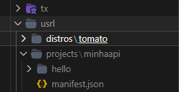
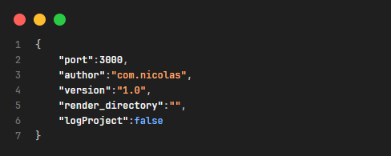
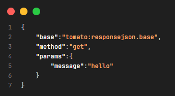

## understanding_structure

the structure of tomato-x engine is separated into user land (usrl) and tomato x (tx).

at the moment you just need to worry about the usrl folder.



it is necessary to have a manifest.json file in the projects/test folder, it is an input file to define the main characteristics of your API.

this is the necessary structure of a manifest.json file to define a api:

````
{
    "port":3000, // api port
    "author":"yourname", // author of api
    "version":"1.0", // api version
    "render_directory":"", // directory to read and render routes. "" is root
    "logProject":false // logProject show all the configurations and objects of your application
}
````

all routes were inside ./usrl/projects/yourproject/render_directory/routename/index.json

this is the necessary structure of a index.json file to define a route: 



````
{
    "base":"tomato:responsejson.base", // base chosen to execute
    "method":"get", // route method: 'get','post','put','delete','patch','options'
    "params":{ // base parameters
        "message":"hello" // base parameter responsejson <message:string> 
    }
}
````